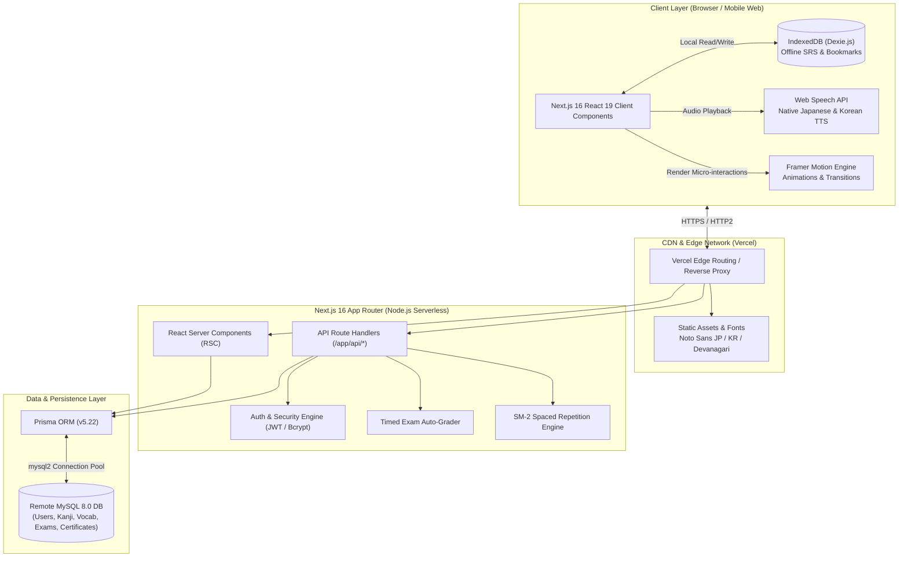
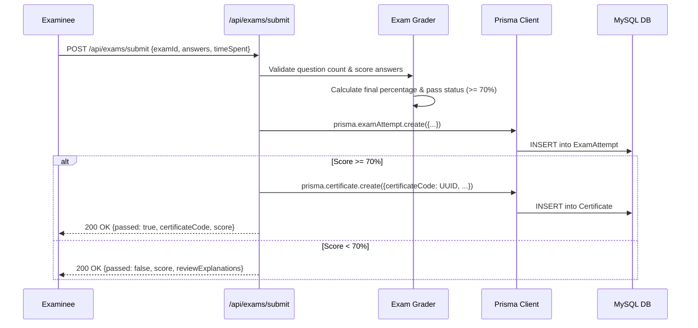
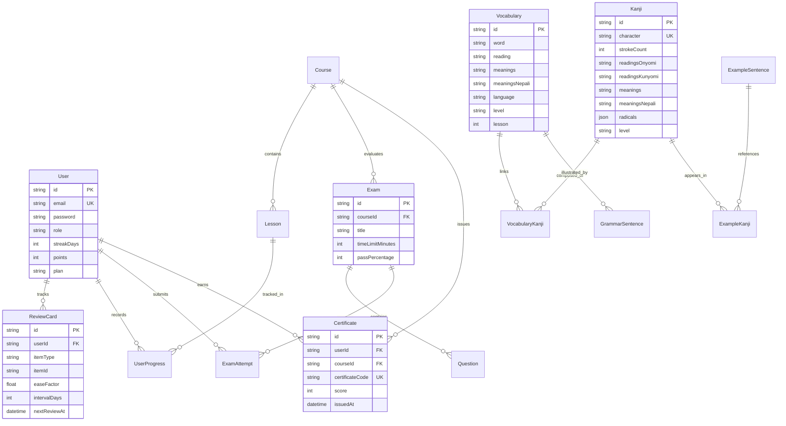

# 🏛️ System Architecture Document (ARCHITECTURE.md)

**Project Name:** JapanKoreaHub (Repository: `LanguageGuru`)  
**Architecture Style:** Full-Stack Modular Monolith (Next.js 16 App Router + Prisma ORM + Offline-First Client)  
**Production Runtime:** Node.js 18+ / Vercel Serverless  
**Database Engine:** MySQL 8.0+ (Remote / PlanetScale-compatible) with Client-side IndexedDB (Dexie.js)  
**Status:** Active Production  

---

## 1. High-Level System Architecture



---

## 2. Tech Stack Matrix

| Tier | Technology | Version | Purpose & Strategic Rationale |
|---|---|---|---|
| **Framework** | Next.js (App Router) | 16.2.x | High-performance React framework with server-side rendering, streaming, and edge route handlers. |
| **UI Library** | React | 19.2.x | Modern concurrent rendering, Server Actions, and optimal component lifecycle. |
| **Language** | TypeScript | 5.4.x | Complete end-to-end type safety across database models, API contracts, and UI components. |
| **Styling** | Tailwind CSS | 4.3.x | Zero-runtime CSS with modern `@theme` variables and utility-first responsive styling. |
| **Database ORM** | Prisma | 5.22.x | Declarative schema modeling, automatic migration management, and fully type-safe SQL query generation. |
| **Relational DB**| MySQL | 8.0.x | ACID-compliant relational data store with pooling via `mysql2`. |
| **Client Storage**| Dexie.js | 4.4.x | IndexedDB wrapper for instant offline flashcard reviews and state caching. |
| **Animation** | Framer Motion | 12.4.x | Fluid 60fps micro-animations, slide-up drawers, and flashcard 3D flips. |
| **Search Engine**| Fuse.js | 7.5.x | Client-side fuzzy search across Kanji radicals, Romaji, and Devanagari hints. |
| **Icons** | Lucide React | 1.26.x | Crisp, tree-shakeable SVG icon set with consistent visual weight. |
| **Auth** | Custom JWT + BcryptJS | 9.0.x / 3.0.x | Stateless JSON Web Token authentication with bcrypt hashed password storage. |

---

## 3. Data Flow Architecture

### 3.1 Offline-First Spaced Repetition (SRS) Data Flow
```mermaid
sequenceDiagram
    participant User as Student Browser
    participant Dexie as IndexedDB (Dexie)
    participant API as /api/srs/review
    participant DB as Remote MySQL

    Note over User,Dexie: Phase 1: Local-First Immediate Execution
    User->>Dexie: Fetch due cards for today
    Dexie-->>User: Return due card IDs & intervals
    User->>User: Reviews card & clicks "Good" (Rating 3)
    User->>Dexie: Compute new SM-2 interval; write card status
    Note over User,Dexie: UI updates immediately (0ms network latency)

    Note over User,DB: Phase 2: Asynchronous Cloud Persistence
    User->>API: Background fetch POST /api/srs/review (Batch or Single)
    API->>DB: Prisma update ReviewCard (easeFactor, intervalDays, nextReviewAt)
    DB-->>API: Acknowledged
    API-->>User: Synced confirmation status
```

### 3.2 Exam Submission, Verification & Certificate Generation Flow


---

## 4. Entity Relationship (ER) Diagram



---

## 5. Directory Structure & Modular Breakdown

```
LanguageGuru/
├── app/                                 # Next.js 16 App Router Directory
│   ├── [country]/                       # Dynamic country hub (/japan, /korea)
│   ├── admin/                           # Administrative panel (notices, users, stats)
│   ├── api/                             # Serverless Route Handlers
│   │   ├── auth/                        # Login, registration, session validation
│   │   ├── community/                   # Posts, bookmarks, phone verification
│   │   ├── exams/                       # Mock exam retrieval & submission
│   │   ├── kanji/                       # Kanji lookup & radical decomposition
│   │   ├── srs/                         # Spaced repetition card synchronizer
│   │   └── vocab/                       # Japanese & Korean vocabulary queries
│   ├── blog/                            # Editorial guides & migration stories
│   ├── consultancy/                     # 1-on-1 counselor booking pipeline
│   ├── dashboard/                       # Student progress, streaks & analytics
│   ├── exams/                           # Interactive exam interface & certificates
│   ├── guide/                           # Step-by-step living & working manuals
│   ├── jobs/                            # Vetted job boards (SSW, E-9, Student)
│   ├── learn/                           # Primary study portal (Kanji, Vocab, Grammar)
│   ├── life/                            # Cultural adaptation & survival tips
│   ├── notices/                         # Official alerts with embassy feeds
│   ├── profile/                         # User settings & certification vault
│   ├── rooms/                           # Peer audio/text study spaces
│   ├── skills/                          # SSW Caregiving & Cleaning skill manuals
│   ├── study/                           # University & language school directories
│   ├── visa/                            # Visa eligibility calculators & checklists
│   ├── work/                            # Salary calculators & employment laws
│   ├── globals.css                      # Master design tokens & theme rules
│   ├── layout.tsx                       # Root layout (fonts, providers, bottom nav)
│   └── page.tsx                         # Landing homepage & language switcher
├── components/                          # Reusable UI Component Library
│   ├── caregiving/                      # Caregiving equipment diagrams & body mechanics
│   ├── community/                       # Discussion cards, ShareModal, verification
│   ├── AlphabetGrid.tsx                 # Hiragana, Katakana & Hangul grids
│   ├── FlashcardCard.tsx                # 3D interactive Japanese SRS card
│   ├── KoreanFlashcardCard.tsx          # 3D interactive Korean SRS card
│   ├── KanjiGrid.tsx                    # Clickable Kanji card matrix
│   ├── RadicalBreakdown.tsx             # Visual radical decomposition component
│   ├── TimedExamEngine.tsx              # 50-minute exam simulator with countdown
│   └── VocabularyExplorer.tsx           # Lesson vocab with inline Kanji links
├── lib/                                 # Shared Business Logic & Static Datasets
│   ├── all-ssw-exams-data.ts            # SSW exam question repository
│   ├── auth-security.ts                 # Password hashing & JWT signing
│   ├── caregiving-book-data.ts          # Complete Caregiving (Kaigo) textbook data
│   ├── db.ts                            # Global Prisma client singleton instance
│   ├── grammar-guide.ts                 # Japanese & Korean bilingual grammar rules
│   ├── kanji-dataset.ts                 # 1000+ Kanji stroke & radical dataset
│   ├── korean-vocab.ts                  # EPS-TOPIK 1-60 lesson vocabulary
│   ├── nihongo-vocab.ts                 # Minna no Nihongo 1-75 lesson vocabulary
│   ├── offline-sync.ts                  # Dexie.js sync workers
│   └── srs-engine.ts                    # SM-2 algorithmic interval computation
├── prisma/
│   └── schema.prisma                    # Master database schema definition
├── public/                              # Static public assets, audio & icons
└── tailwind.config.ts                   # Tailwind CSS theme configuration
```

---

## 6. Security & Performance Architecture

### 6.1 Authentication & Authorization
- Passwords are encrypted using `bcryptjs` with a cost factor of 10.
- Sessions are managed via encrypted HTTP-only JWT cookies to prevent XSS credential theft.
- Role-Based Access Control (RBAC): `STUDENT`, `INSTRUCTOR`, `ADMIN` with protected `/admin` route middleware.

### 6.2 Database Connection Optimization
- `lib/db.ts` implements the singleton pattern on `globalThis` to prevent connection exhaustion in serverless function invocations:
```typescript
import { PrismaClient } from '@prisma/client';

const globalForPrisma = globalThis as unknown as {
  prisma: PrismaClient | undefined;
};

export const db = globalForPrisma.prisma ?? new PrismaClient();

if (process.env.NODE_ENV !== 'production') globalForPrisma.prisma = db;
```

### 6.3 Intellectual Property & Anti-Scraping Protection
- Core vocabulary and textbook views have `-webkit-user-select: none` enabled for non-input containers.
- Content watermark elements are dynamically injected to identify leaked proprietary study materials.
- Client-side image and SVG drag operations are disabled by default.

---

## 7. Universal Architecture Blueprint for Upcoming Projects

When architecting a new application within the ecosystem, adhere to these architectural standards:
1. **Directory Structure**: Always utilize the Next.js App Router with separated `components/`, `lib/`, `prisma/`, and `app/api/` directories.
2. **Database Access**: All database operations must go through Prisma ORM via a single instantiated client. Direct SQL is only permitted for complex analytical aggregations.
3. **Offline Strategy**: Any application with repetitive review tasks (flashcards, forms, drafts) must implement a Dexie.js IndexedDB client layer.
4. **Localization Architecture**: Multi-script apps must pre-load native Google Fonts (`Noto Sans JP`, `Noto Sans KR`, `Noto Sans Devanagari`) in the root `layout.tsx` to prevent layout reflows.
