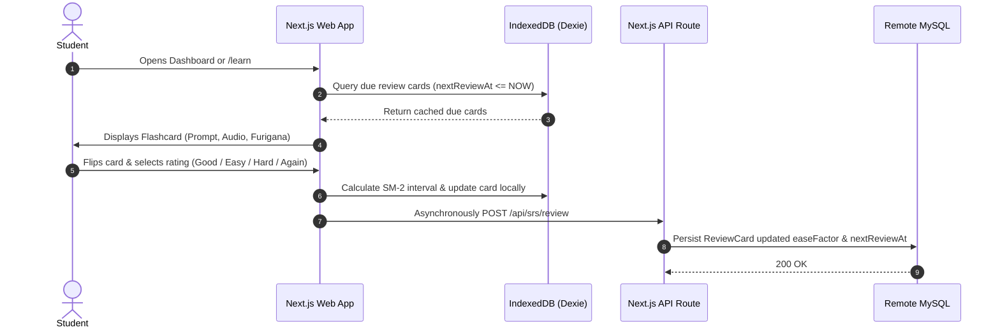
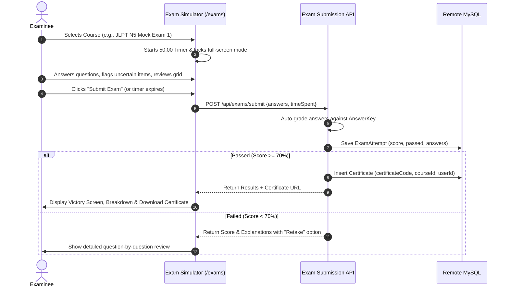

# 📄 Product Requirements Document (PRD)

**Project Name:** JapanKoreaHub (Codebase: `LanguageGuru`)  
**Product Version:** 1.0.0 (Production / Next.js 16)  
**Author / Product Owner:** Dr. Kafle ([@DRKAFLE123](https://github.com/DRKAFLE123))  
**Target Markets:** Nepal, South Asia, Japan, South Korea  
**Last Updated:** September 2026  

---

## 1. Executive Summary & Problem Statement

### 1.1 The Challenge
Every year, tens of thousands of youth and professionals from Nepal and South Asia prepare for life, work, and education in **Japan** and **South Korea**. They encounter critical hurdles:
1. **Scattered & Expensive Resources**: Quality JLPT (N5–N3) and EPS-TOPIK / TOPIK preparation is locked behind costly consultancy fees or fragmented across physical books without audio pronunciation.
2. **Language Barrier in Technical Contexts**: Explanations of complex grammar or vocational concepts in English alone are often ineffective; learners require native **Nepali (नेपाली)** explanations alongside English.
3. **Vocational Skill Deficit**: Applicants for Japan's Specified Skilled Worker (SSW - 特定技能) programs—especially **Caregiving (介護 - Kaigo)** and **Building Cleaning**—lack interactive visual diagrams, domain terminology, and practice exams.
4. **Uncertainty & Fraud in Visas/Jobs**: Aspirants struggle with unverified job notices, ambiguous visa requirements, and lack of direct consultancy appointments.
5. **Inefficient Rote Memorization**: Learners forget vocabulary quickly without an algorithmic spaced repetition system (SRS).

### 1.2 The Solution: JapanKoreaHub
**JapanKoreaHub** is a unified, full-stack digital ecosystem providing:
- **Comprehensive Dual-Language Learning**: JLPT Japanese (N5 → N3) and Korean (EPS-TOPIK 1 → 60) with bilingual English and Nepali translations, clickable Kanji breakdowns, and browser TTS audio.
- **Scientifically Proven Spaced Repetition (SRS)**: Offline-first SM-2 flashcard memory system.
- **Vocational SSW Training Hub**: Specialized textbooks, visual equipment diagrams, and domain exams for Caregiving and Building Cleaning.
- **Timed Mock Exam Engine**: Realistic JLPT and EPS-TOPIK exam simulation with instant auto-grading, answer review, and verifiable digital certificates.
- **Community & Guidance**: Peer discussion boards, verified job and visa bulletins, and 1-on-1 consultancy appointment scheduling.

---

## 2. Target Personas

| Persona | Demographics & Goal | Primary Pain Points | Key Platform Features Used |
|---|---|---|---|
| **Ram (EPS Aspirant)** | 24, Chitwan, Nepal.<br>Preparing for Korea EPS-TOPIK manufacturing exam. | Struggling with Korean vocabulary speed and listening questions; needs Nepali translations. | Korean Vocabulary Explorer (Lessons 1–60), EPS Timed Mock Exam Engine, Flashcards. |
| **Sita (SSW Caregiver)** | 26, Kathmandu, Nepal.<br>Targeting Japan SSW (Kaigo) Caregiver visa. | Understanding Japanese medical/caregiving terms and equipment safety procedures. | Caregiving Book Data, Visual Equipment Diagrams, SSW Mock Exam Simulator. |
| **Bibek (Tech Student)** | 21, Pokhara, Nepal.<br>Aspiring university/IT applicant for Tokyo. | Kanji memorization, Onyomi/Kunyomi confusion, and official visa document checklists. | Clickable Kanji Radical Inspector, JLPT N3 Grammar Guides, Visa Verification Hub. |
| **Consultant / Admin** | Language School Owner & Visa Advisor. | High inquiry volume, unorganized student test tracking, manual counseling bookings. | Admin Dashboard, Notice Management, Consultancy Booking System, Certificate Verifier. |

---

## 3. Product Scope & Core Feature Modules

```
JapanKoreaHub Product Suite
├── 1. Language Learning Core
│   ├── Japanese System (JLPT N5, N4, N3, Minna no Nihongo 1-75)
│   ├── Korean System (EPS-TOPIK Lessons 1-60, Hangul, Romanization)
│   ├── Interactive Kanji Explorer & Radical Visualizer
│   └── Offline-Capable SM-2 Flashcard Engine (Dexie.js)
├── 2. Examination & Certification Engine
│   ├── Timed Mock Exams (50-minute JLPT & EPS-TOPIK simulator)
│   ├── Question Navigator, Anti-Cheat & Auto-Grading
│   └── Cryptographic Digital Certificate & QR Verification
├── 3. Vocational & SSW Specialized Modules
│   ├── Caregiving (Kaigo) Textbook, Vocabulary & Equipment Diagrams
│   ├── Building Cleaning Operational Modules & Protocols
│   └── Multi-Sector SSW Practice Exams
├── 4. Community & Social Hub
│   ├── Discussion Posts, Categorized Questions & Bookmarks
│   ├── Phone Verification & Multi-Channel Sharing (WhatsApp, Viber, etc.)
│   └── Real-Time Study Rooms & Discussion Feeds
└── 5. Opportunities, Visas & Services
    ├── Verified Visa Pathways & Document Checklists
    ├── Direct Job Vacancies & Government Notice Feed
    └── 1-on-1 Study Abroad Consultancy Booking System
```

### 3.1 Japanese Learning Engine
- **Curriculum Coverage**: Minna no Nihongo Lessons 1 through 75 (JLPT N5, N4, N3).
- **Kanji Inspector**:
  - Modal breakdown displaying stroke order SVG data, Onyomi, Kunyomi, meanings in English and Nepali.
  - Radical color-coding and mnemonics.
  - Linked compound vocabulary list for contextual learning.
- **Grammar Guides**: Detailed grammar points per lesson with parallel Japanese, Romaji, English, and Nepali translations.
- **Audio TTS**: Browser Web Speech API text-to-speech for all vocabulary and example sentences.

### 3.2 Korean Learning Engine
- **Curriculum Coverage**: Standard EPS-TOPIK Lessons 1 to 60.
- **Hangul Master**: Consonant/vowel charts with audio guides and Nepali pronunciation hints.
- **Vocabulary & Grammar**: 300+ core high-yield words, full grammar breakdown, workplace terminology.
- **Flashcard Integration**: Instant one-click card creation to SRS review deck.

### 3.3 Spaced Repetition (SRS) Engine
- **Algorithm**: Modified SuperMemo SM-2.
- **Rating Choices**: *Again* (Reset interval), *Hard* (1.2x), *Good* (Standard factor), *Easy* (Bonus factor).
- **Offline Resilience**: Instant local indexing in IndexedDB via Dexie.js with background synchronization to remote MySQL upon network availability.

### 3.4 Mock Exam & Certification Engine
- **Timer & Anti-Cheat**: 50-minute countdown, automatic submission on timer expiration, tab-switch warning alerts.
- **Question Layout**: Multiple-choice, audio listening prompts, fill-in-the-blank, question flag/review grid.
- **Instant Auto-Grading**: Detailed performance report with question-by-question explanations.
- **Verifiable Certificates**: Unique UUID certificate codes, shareable URLs (`/exams/certificate/[code]`), and verification badges.

### 3.5 SSW Vocational Modules (Caregiving & Cleaning)
- **Caregiving (Kaigo)**: Body mechanics, hygiene assistance, meal support, vital signs, emergency response.
- **Interactive Equipment Diagrams**: Wheelchair breakdown, care bed controls, transfer lifts, cane/walker adjustments.
- **Building Cleaning**: Chemical safety, floor maintenance machines, safety protocols, waste segregation.

### 3.6 Community & Guidance
- **Community Feed**: Post questions, vote, filter by category (`#jlpt`, `#epstopik`, `#visa`, `#life`).
- **Safety & Verification**: Phone verification flow for anti-spam community posting.
- **Consultancy Bookings**: Real-time calendar reservation for 1-on-1 visa/study abroad sessions.
- **Official Notices**: Verified notices from embassies, EPS centers, and immigration offices with pin alerts.

---

## 4. End-to-End User Flows

### 4.1 Daily Study & SRS Review Flow


### 4.2 Timed Mock Exam to Certificate Flow


---

## 5. Non-Functional Requirements (NFRs)

1. **Performance**:
   - First Contentful Paint (FCP) < 1.2s.
   - Largest Contentful Paint (LCP) < 2.0s on 4G mobile connections.
   - Cumulative Layout Shift (CLS) < 0.05.
2. **Mobile-First & Touch Usability**:
   - 100% of study workflows functional on 360px width mobile screens.
   - Native bottom navigation bar active strictly below `768px`.
3. **Multilingual Typography**:
   - Smooth rendering without glyph fallback distortion for Devanagari (`Noto Sans Devanagari`), Japanese (`Noto Sans JP`), and Korean (`Noto Sans KR`).
4. **Offline Resilience**:
   - Core vocabulary lists, Kanji definitions, and SRS reviews must be accessible and operable when offline.
5. **Content Protection**:
   - Client-side selection protection on core curriculum text and dynamic content watermarks to deter unauthorized mass scraping.

---

## 6. Success Metrics & Key Performance Indicators (KPIs)

| Metric | Target | Tracking Mechanism |
|---|---|---|
| **Daily Active Learners (DAL)** | 10,000+ monthly active learners | Client & server telemetry (`lib/analytics.ts`) |
| **Flashcard Retention Rate** | > 85% card retention after 21 days | ReviewCard easeFactor & repetition metrics in DB |
| **Mock Exam Completion Rate** | > 75% of started exams submitted | ExamAttempt status logging (`COMPLETED` vs `ABANDONED`) |
| **Exam Pass Rate on Platform** | > 68% passing score (>= 70%) | Automated exam attempt aggregation |
| **Consultancy Conversion** | > 15% booking-to-counseling rate | ConsultancyBooking status pipeline |

---

## 7. Universal PRD Blueprint for Upcoming Projects

When creating a new project in this ecosystem, use this checklist to instantiate its PRD:
- [ ] **Section 1**: Problem Statement, Target Market, and Value Proposition.
- [ ] **Section 2**: 3–4 Specific User Personas with demographic and situational context.
- [ ] **Section 3**: Modular Feature Tree broken down into numbered Epics.
- [ ] **Section 4**: Step-by-Step Mermaid User Journey Diagrams.
- [ ] **Section 5**: Quantitative NFRs (Performance, Accessibility, Security).
- [ ] **Section 6**: Measurable KPIs and telemetry schema.
